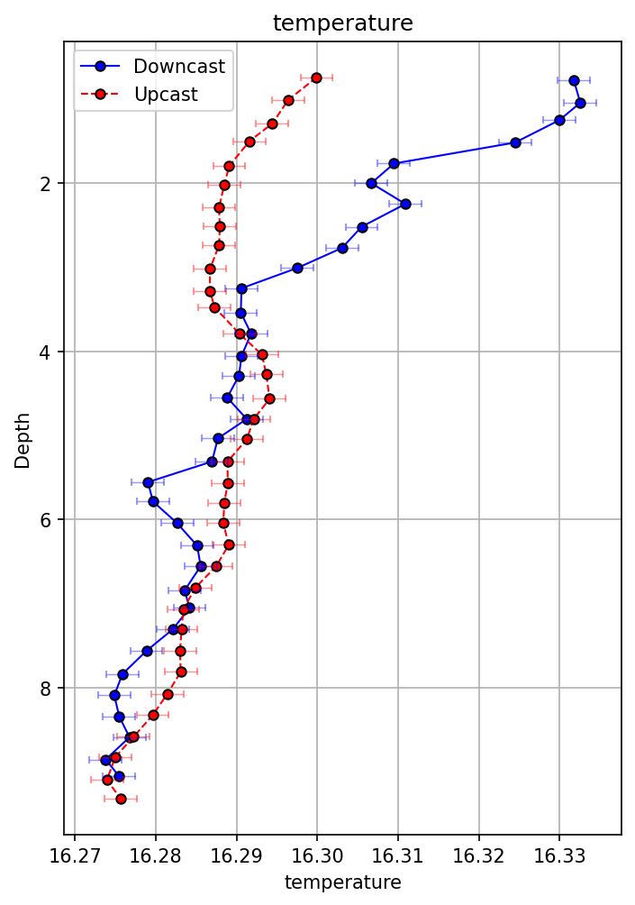

<p align="center">
  
</p>

# SOMLIT RBR toolbox      
**
## Description

This GitHub repository holds python functions to process RBR Maestro CTD data collected at SOMLIT observatory in Plouzané, France. It can be adapted to other SOMLIT sites.

The aim is to provide [SOMLIT](https://www.somlit.fr/) community a list of functions to help process RBR CTD data according to SOMLIT standards. It could useful if your SBE CTD is in calibration and is temporary, perhaps definitely replaced by a RBR Maestro. CTD is deployed in shallow water (< 10m depth) off a quay.

The functions are based on [pyRSKtools](https://docs-static.rbr-global.com/pyrsktools/index.html) free library developped by RBR. 

It has been developped at the European Institute for Marine Studies (IUEM), Plouzané, France. It is open-source to encourage colleagues from oceanographic research laboratories use it and contribute.

## Contents

- **RSKsomlit_plt.py**: contains plotting functions only
- **RSKsomlit_proc.py**: contains processing functions only
- **sensor_uncertainties.py** is a ressource file containing the sensor uncertainties for each channel used to show the error bars in the plots
- **sites.py** is the list of SOMLIT sites with corresponding Lat, Lon used in the processing
- **main.py** is the main python script to run to process the list of .rsk files located in the raw_rsk_files folder
- **raw_rsk_files** is a folder containing raw rsk files to process. They have logged during the summer 2024 at the SOMLIT point of Plouzané by the SOMLIT team of IUEM
- **environment.yml** is the file containing all packages and dependencies of the conda environment used to develop the code. It hase been created with command:
    ```bash
    conda env export > environment.yml
    ```

## Features

- Reads a list of raw .rsk files in a folder:
    - find in each .rsk file the date and create a unique .rsk file per day
    - handles multiples days in a .rsk file
    - handles dupplicated days in the folder to have one file per day only
- Process each daily .rsk file:
    - computes down(d) and up(u) casts with 0.25 m binning
    - outputs RBR .csv and SOMLIT .txt files for d and u casts
    - outputs graphics with d and u cast for each parameter (salinity, temperature, etc...)

<p align="center">
  
</p>

## Functionality

- The code is based on pyRSKtools open source RBR python library to process the data
- Custom functions have been developped to avoid opening Ruskin and reduce clicks when handling the .rsk files and detecting the SOMLIT days and profiles. 
- Plots are to help the user choose between the down or the upcast which to save in the SOMLIT DB. 

## Using the code

### Installation steps

1. Load the conda environement : [Miniconda](https://docs.conda.io/en/latest/miniconda.html) or [Anaconda](https://www.anaconda.com/)

2. Clone the Repository on your machine:
   ```bash
   git clone https://github.com/epoirierIRD/Somlit_rbr_toolbox.git
   ```
3. Create the conda environment from the provided environment.yml file provided. This file contains all packages and dependencies you need to run the code.
    ```bash
    conda env create -f environment.yml
    ```
4. Activate the conda environement
    ```bash
    conda activate myenv
    ```
You can rename the environement at this setp.

5. Update the **main.py** file with the correct path where you have stored the repository

6. Run the program 
    ```bash
    python main.py
    ```
7. A folder is created under your_path/Somlit_rbr_toolbox/procdata
containing the outputs for all the .rsk files processed. They are stored in one
folder for each daily file.

## Avenues for Improvement

- Remove useless lines of code
- Develop new function
- Develop a friendly user interface for non python users

Contributions are welcomed to improve these points.

## To contribute

Follow this procedure contribute:

1. **Fork the repository** and create your branch (my-new-feature):

   ```bash
   git checkout -b my-new-feature
   ```

2. **Make your changes** and test them thoroughly.


4. **Submit a Pull Request** with a detailed description of your changes.

## Contributors

IUEM:
- Emilie Grossteffan
- Etienne Poirier
- Peggy Rimmelin-Maury

## License

This project is licensed under [CC BY-SA 4.0]. 

