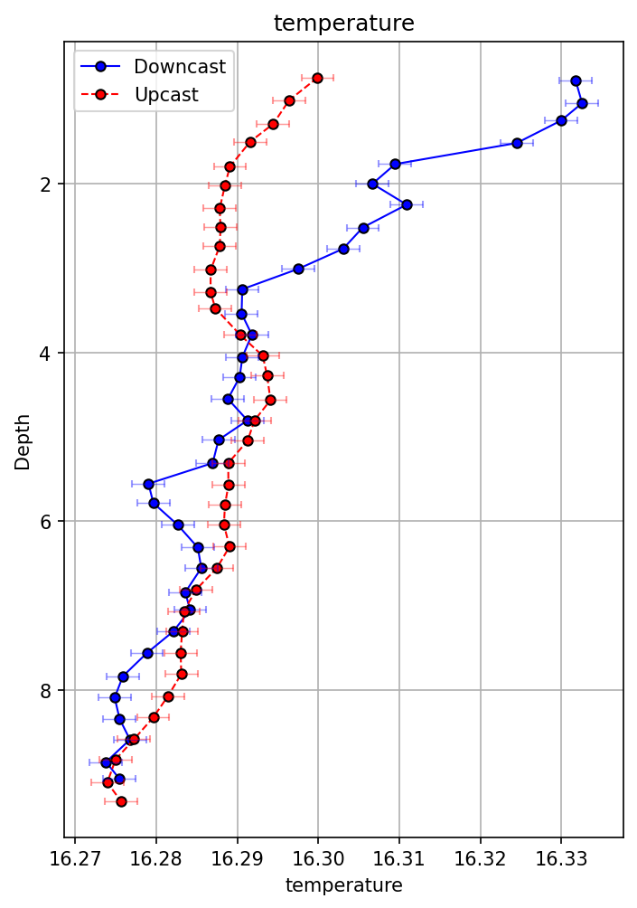

<p align="center">
  
</p>

# SOMLIT RBR toolbox      
**
## Description

This GitHub repository holds python functions to process RBR Maestro CTD data collected at SOMLIT observatory in Plouzané, France. It is meant to be adaptable to other SOMLIT sites and
to be used by the whole SOMLIT community.

The aim is to provide [SOMLIT](https://www.somlit.fr/) community a list of functions to help process RBR CTD data according to SOMLIT standards. It could useful if your SBE CTD is in calibration and is temporary,
perhaps definitely replaced by a RBR Maestro. CTD is deployed in shallow water (< 10m depth) off a quay.

The functions are based on [pyRSKtools](https://docs-static.rbr-global.com/pyrsktools/index.html) free library developped by RBR. 
Use pyRSKtools version 1.1.2 (oct. 2025).

It has been developped at the European Institute for Marine Studies (IUEM), Plouzané, France. Specifications have been drawn up by Emilie Grossteffan and Peggy Rimmelin-Maury, active members of the SOMLIT community.
Code has been written by Etienne Poirier, IRD instrumentalist engineer, non SOMLIT member. Be aware that it is a code written by a non-IT engineer with all the cons that this implies.

It is open-source to encourage colleagues from oceanographic research laboratories use it and contribute.
The author would like to thank Mathieu Dever, RBR chief scientist for sharing his code and tutorials especially on RBR CODA data processing.

## Contents

- **RSKsomlit_plt.py**: contains plotting functions only
- **RSKsomlit_proc.py**: contains processing functions only
- **sensor_uncertainties.py** is a ressource file containing the sensor uncertainties for each channel used to show the error bars in the plots
- **sites.py** is the list of SOMLIT sites with corresponding Lat, Lon used in the processing
- **main_process.py** is the script to run to process the rbr_maestro.rsk files located in the raw_data folder
- **main_SBE_rbr_compar.py** is the script to compar processed RBR data with processed SBE data when doing an inter-comparison
- **raw_data** is a folder containing a raw rsk file to process and processed SBE data files to use as reference.
    rbr_maestro.rsk contains a profile from Lanveoc (14/10/2025) and 2 profiles from Ste Anne du Porzic(16/10/2025)
- **environment.yml** is the file containing all packages and dependencies of the conda environment used to develop the code. It hase been created with command:
    ```bash
    conda env export > environment.yml
    ```

## Code features
**main_process.py**
- Reads a raw .rsk file:
    - creates one .rsk file per profile (in /proc_data/)
    - handles multiples days in a .rsk file
- Process each daily .rsk file:
    - computes down(d) and up(u) casts with 0.25 m binning
    - outputs RBR .csv and SOMLIT .txt files for d and u casts
    - outputs graphics with d and u cast for each parameter (salinity, temperature, etc...)
    - outputs in '/proc_data/outputs

**main_SBE_rbr_compar.py**
- Reads processed rbr file with upcast and downcast from proc_data/outputs
- Compares RBR data with SBE data (/raw_data) on upcast and downcast and output plots in /figures

<p align="center">
  
</p>

## Functionality

- The code is based on **pyRSKtools v1.1.2** open source RBR python library to process the data
- Custom functions have been developped to avoid opening Ruskin GUI and reduce clicks when handling the .rsk files and detecting the SOMLIT days and profiles
- Plots are to help the user choose between the down or the upcast which to save in the SOMLIT DB. 

## Using the code

### Installation steps

1. Load the conda environement : [Miniconda](https://docs.conda.io/en/latest/miniconda.html) or [Anaconda](https://www.anaconda.com/)

2. Clone the Repository on your machine:
   ```bash
   git clone https://github.com/epoirierIRD/Somlit_rbr_toolbox.git
   ```
3. Create the conda environment from the provided environment.yml file provided. This file contains all packages and dependencies you need to run the code.
**Be aware the pyrsktools pacakge is not in the .yml and must be installed via pip install.**   
    ```bash
    conda env create -f environment.yml
    ```
4. Activate the conda environement
    ```bash
    conda activate myenv
    ```
You can rename the environement at this setp.

5. Update the **main_process.py** file with the correct path where you have stored the repository if needed

6. To test the code on the raw_data provided run the program main_process.py
    ```bash
    python main_process.py
    ```
7. A folder is created under your_path/Somlit_rbr_toolbox/proc_data
contaiins the outputs for all the .rsk files processed. They are stored in one
folder for each daily file. 

## Raise an issue

- When using the code any issue you will see or any idea that comes to your mind, please submit it via the github toolbox
Issue/ Create new Issue. That will help developpers improving the code for your needs.

## Avenues for Improvement

- Migrate the repository for github to https://versio.iuem.eu GitLab
- Remove useless lines of code / excessive comments
- Develop new functions
- Develop a friendly user interface for non python users, perhaps with a Windows .exe program
- Rebuilt the code with an object object-oriented programming (OOP) strategy

Contributions are welcomed to improve these points.

## To contribute

First step to contribute is to raise issues! 
Otherwise:

Follow this procedure to contribute:

1. **Fork the repository** and create your branch (my-new-feature):

   ```bash
   git checkout -b my-new-feature
   ```

2. **Make your changes** and test them thoroughly.


3. **Submit a Pull Request** with a detailed description of your changes.

## Contributors

IUEM:
- Etienne Poirier
- Emilie Grossteffan
- Peggy Rimmelin-Maury

## License

This project is licensed under [CC BY-SA 4.0]. 

